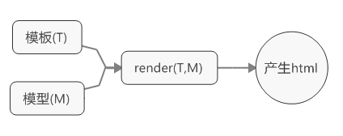
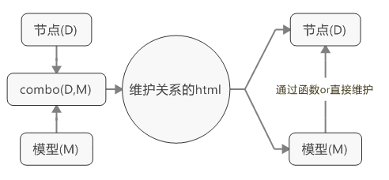
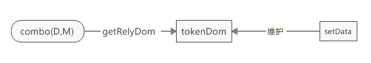
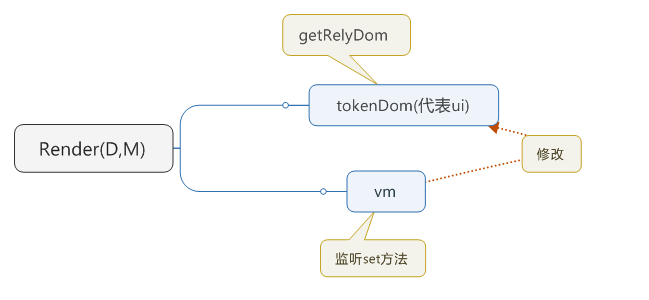

## 模板+数据管理
U=T(D);    
后端模板,比如jsp,ejs通过模板与数据组合后,返回结果,此后模板功能也就结束了    
前端模板,可以在后端模板的基础上,对模板做进一步的管理,比如通过函数,甚至数据的改变,用以变更Ui    

注:此处,强调前端模板,指的是,前端利用的是自身对dom操作的便利性,所应用的一种方式,依赖dom操作,具有类似特性的模板,基本上没法后端渲染


### 简单的模板
    
模型全部准备好后,执行流程,产生html,如果变更模型后,需要重新render一次    
此处模板为任意字符串均可,通用性极强    

### 前端特色模板
    
创建数据与节点的关系(而非html),数据,关系创建后,可以随时修改模型    
当然,依赖节点    

### combo(D,M)实现
 
如:[test1](test1.html){:target="_blank"}    
getRelyDom根据语法,收集相关节点,丢之属性tokenDom中,而后对外提供setData接口,用以直接修改相关el    


通过主动调用setData去修改ui,model仅作初始化    
也就是MVC    
如果不想通过setData这种调用函数的方式,而是直接修改data    
让data不光初始化,而且一直代表的整个ui的模型(VM)    

### combo(D,M)实现--拓展Model
    
如:[test2](test2.html){:target="_blank"}    

无论是那种方式,可以发现,关联dom,首先需要获取相关的tokenDom(预编译),也就是说    
通过```$().append()```之类的方式,加入绑定语法是无效的    
要么想办法在加载前全部丢进去    
或者使用```extraRelyDom(dom)```的函数去实现(代表在已经编译过的dom内部,再次追加相关的dom,例子中并未实现)    

### 模板api兼容
例如```{{}}```之类的语法,是通用模板下的语法,其语义就是v-text    
在实现时,并没有直接实现类似的语法,因为在获取dom时,依赖选择器```querySelectorAll```    
选择器可以根据属性获取节点,但无法根据文本内容去选择    
如果需要类似的功能,需要在getRelyDom前追加一个语义转换```sugarConvert```    
用以将文本内容下的语义,转换至属性中

如:[test3](test3.html){:target="_blank"}   

模板引擎的api虽然很爽,但一般都不会建议去使用,毕竟在```createVmAttr```之前,`{{}}`都是一直显示在界面的

## 版本
git reset --hard 871ed9126639c9128c18bb2f19e6afd42c0c5ad9

