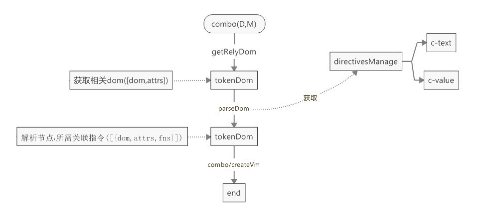

## 指令
### 简单实现
现在,要追加更多的指令,而且允许一个节点挂在多个指令    
总体思路,依然是获取相关节点,解析节点指令,而后绑定三步骤
 

如:[test1](test1.html){:target="_blank"}   
而后,可以发现
* 获取相关指令与解析重复,可直接合并
* tokenDom需要标记结构,比想象的复杂,且会对应多个指令,可以尝试维护更底层的对象,指令,即一个节点包含多个指令
* 没有解析变量(如student.name)
* 不支持数组
* 不包含属性的生命周期(钩子)
* ...

### 简单实现2
先简单一下流程
* 将parseDom,createVm合并为_compileNode
* _compileNode为解析逻辑,获取节点后,可以直接进行解析(获取Directive)
* 使用es6写法

其流程如下
 
如:[test2](/test2/index.html){:target="_blank"}   

在所有指令解析完毕后,循环初始数据,将初试数据转换为vm,并根据存储的指令,逐步获取相关指令,而后更新    
这种方式最为直接,相关指令就是之前的存储的tokenDom,不过,每个节点又会有多条指令    
test2中,使用```vm.__lookupSetter__```的方式做迭代,进行代替    
纯属忘了传递值    

 
如:[test3](/test3/index.html){:target="_blank"}   
根test2基本相似

### vue实现
直接看vue观摩的早期实现,其实现大致时
 
代码:    
git reset --hard cf1732bea21dcc1637d587d295d534535a92d2b7

流程,还是一样的