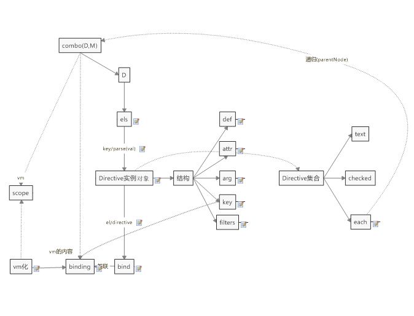

## each
追加数组如下
```html
<li c-each="todos in todo">
      <span c-text="title" ></span>   
</li>
```
* Directive实例对象中的结构key需要进行解析    
对应arg参数,由原本可直接使用,高程需要解析的方式
* each的子参数作用域需要改变
使用迭代的方式进行改变,需要追加el['blocak']标记,用以判断在本次作用域中,是否需要解析

 
如:[test1](test/index.html){:target="_blank"}   

以上只是简单的实现,但还存在易用性的问题
```javascript
data.todos=[{title:'xx'}]//有效果
data.todos.push({title:'yy'})//无效果
```
需要对数组追加更多的监听

* 对数组进行修改函数的监听

## 版本
git reset --hard 31498397366dc036911690e06670a1b0d1746654